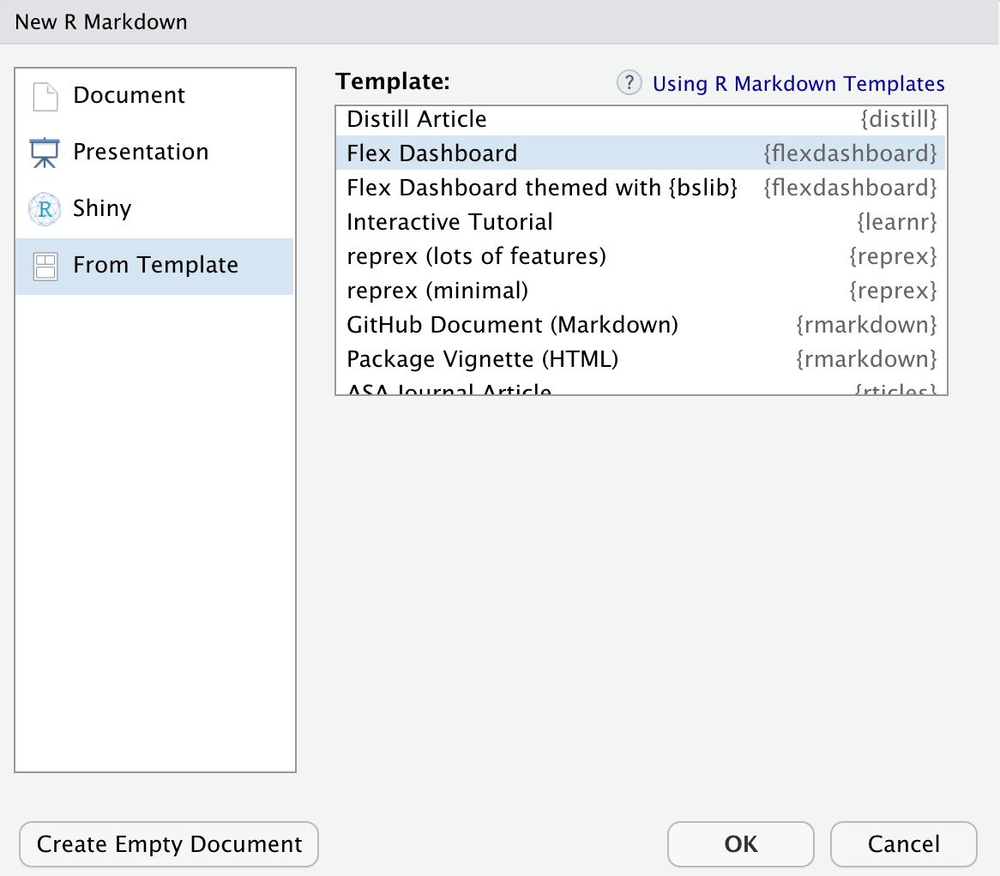

<!-- README.md is generated from README.Rmd. Please edit that file -->

# flexdashboard <a href='https://pkgs.rstudio.com/flexdashboard'></a>

<!-- badges: start -->

[](https://CRAN.R-project.org/package=flexdashboard)
[](https://github.com/rstudio/flexdashboard/actions)
<!-- badges: end -->

The goal of **flexdashboard** is to make it easy to create interactive
dashboards for R, using R Markdown.

- Use [R Markdown](https://rmarkdown.rstudio.com) to publish a group of
  related data visualizations as a dashboard.

- Support for a wide variety of components including
  [htmlwidgets](https://www.htmlwidgets.org); base, lattice, and grid
  graphics; tabular data; gauges and value boxes; and text annotations.

- Flexible and easy to specify row and column-based
  [layouts](https://pkgs.rstudio.com/flexdashboard/articles/layouts.html).
  Components are intelligently re-sized to fill the browser and adapted
  for display on mobile devices.

- [Storyboard](https://pkgs.rstudio.com/flexdashboard/articles/using.html#storyboards-1)
  layouts for presenting sequences of visualizations and related
  commentary.

- Optionally use [Shiny](https://shiny.posit.co/) to drive
  visualizations dynamically.

- Optionally use [bslib](https://rstudio.github.io/bslib/) to easily
  [customize main colors, fonts, and
  more](https://pkgs.rstudio.com/flexdashboard/articles/theme.html).

Learn more about **flexdashboard**:
<https://pkgs.rstudio.com/flexdashboard>

## Examples

<a href="https://testing-apps.shinyapps.io/flexdashboard-d3heatmap/"></img></a>  <a href="https://testing-apps.shinyapps.io/flexdashboard-ggplotly/"></img></a>  <a href="https://jjallaire.shinyapps.io/shiny-biclust/"></img></a>

View more examples
[here](https://pkgs.rstudio.com/flexdashboard/articles/examples.html).

## Installation

Install the **flexdashboard** package from CRAN as follows:

``` r
install.packages("flexdashboard")
```

If you want to use the development version of the **flexdashboard**
package, you can install the package from GitHub via the [**remotes**
package](https://remotes.r-lib.org):

``` r
remotes::install_github('rstudio/flexdashboard')
```

## Usage

To author a **flexdashboard** you create an [R
Markdown](https://rmarkdown.rstudio.com) document with the
`flexdashboard::flex_dashboard` output format. You can do this from
within RStudio using the **New R Markdown** dialog:



If you are not using RStudio, you can create a new `flexdashboard` R
Markdown file from the R console. Currently there are two `templates`:

- `"flex_dashboard"` (basic) and

- `"flex_dashboard_bslib"` (an example of [theming with
  `{bslib}`](https://pkgs.rstudio.com/flexdashboard/articles/theme.html)):

``` r
rmarkdown::draft("dashboard.Rmd",
                 template = "flex_dashboard_bslib",
                 package = "flexdashboard")
```

## Getting help

There are two main places to get help with flexdashboard:

- The [RStudio
  community](https://community.rstudio.com/tags/c/R-Markdown/10/flexdashboard)
  is a friendly place to ask any questions about flexdashboard. Be sure
  to use the `flexdashboard` tag. Add also the `shiny` tag is you are
  using a Shiny runtime.

- [Stack
  Overflow](https://stackoverflow.com/questions/tagged/flexdashboard) is
  a great source of answers to common **flexdashboard** questions. It is
  also a great place to get help, once you have created a reproducible
  example that illustrates your problem. Use the tags
  [`[r][flexdashboard]`](https://stackoverflow.com/questions/tagged/flexdashboard+r)
  if you ask a question. Add the tag `[shiny]` if you are using a Shiny
  runtime.

## Code of Conduct

Please note that the **flexdashboard** project is released with a
[Contributor Code of
Conduct](https://pkgs.rstudio.com/flexdashboard/CODE_OF_CONDUCT.html).
By contributing to this project, you agree to abide by its terms.
