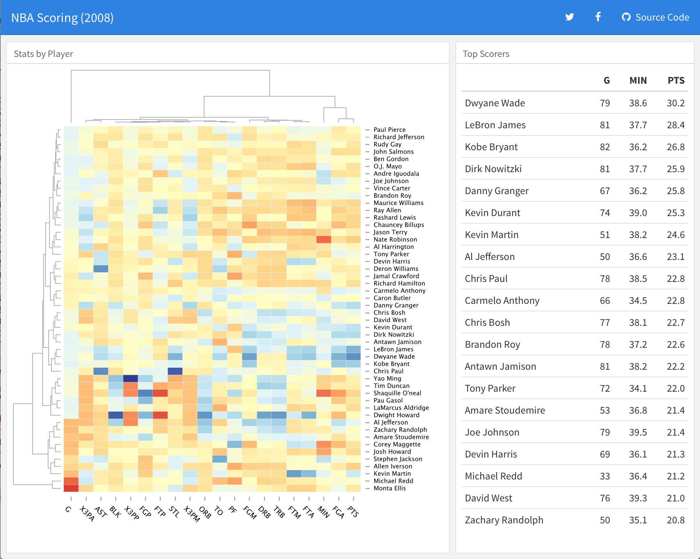
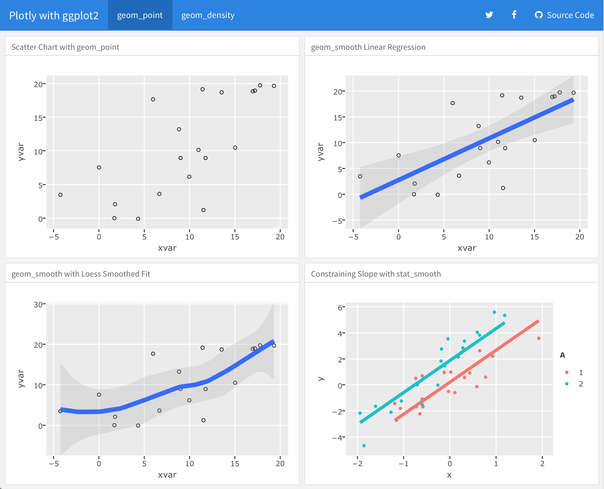
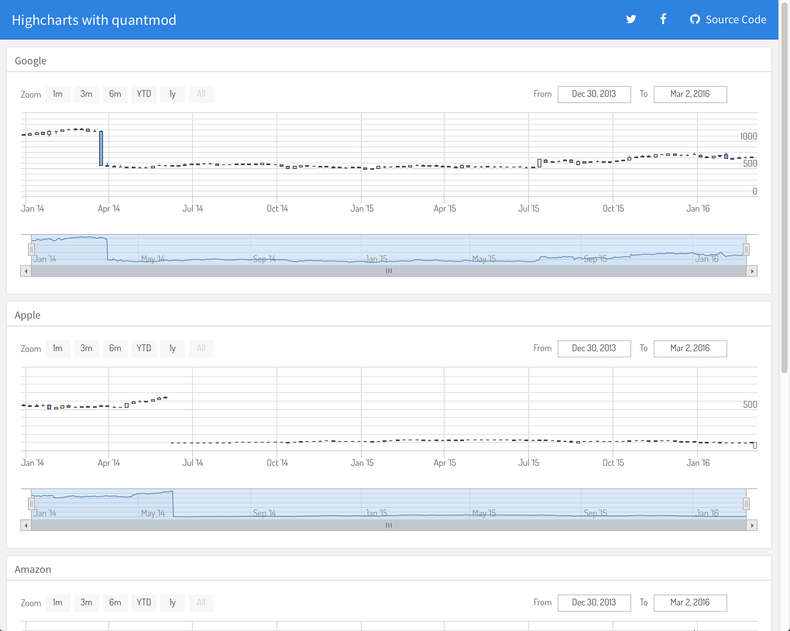
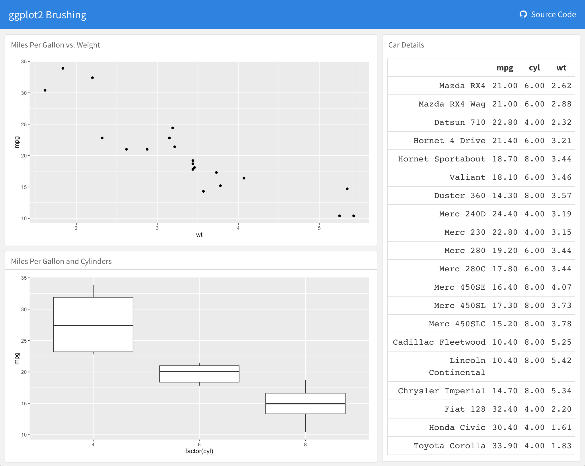

<div id="main-banner" class="row">

<div class="col-sm-10">

* Use [R Markdown](http://rmarkdown.rstudio.com) to publish a group of related data visualizations as a dashboard.

* Ideal for publishing interactive JavaScript visualizations based on [htmlwidgets](http://www.htmlwidgets.org).

* Flexible and easy to specify layouts, including automatic sizing of charts to fill the browser.

* Optionally use [Shiny](http://shiny.rstudio.com) to drive visualizations dynamically.

</div>

</div>


<div class="row">

<div class="col-md-4">
<a href="https://rstudio-pubs-static.s3.amazonaws.com/157935_4a5a5cb2d447495d8cfc356251c3e437.html" class="thumbnail">

</a>
</div>

<div class="col-md-4">
<a href="https://rstudio-pubs-static.s3.amazonaws.com/157936_b8de6c18b00240c6a42785ce8a1a1fdc.html" class="thumbnail">

</a>
</div>


<div class="col-md-4">
<a href="https://rstudio-pubs-static.s3.amazonaws.com/157937_dc7c4031822441a88a05277d38f34f0e.html" class="thumbnail">

</a>
</div>

</div>

<div class="row">

<div class="col-md-4">
<a href="https://rstudio-pubs-static.s3.amazonaws.com/158113_22099332823e428bb4e7951cf702da39.html" class="thumbnail">

</a>
</div>

<div class="col-md-4">
<a href="https://jjallaire.shinyapps.io/shiny-ggplot2-brushing/" class="thumbnail">

</a>
</div>

<div class="col-md-4">
<a href="https://jjallaire.shinyapps.io/shiny-kmeans/" class="thumbnail">

</a>
</div>


</div>


## Getting Started

Install the **flexdashboard** package from GitHub as follows:

```r
devtools::install_github("rstudio/flexdashboard")
```

To author a flexdashboard you create an [R Markdown](http://rmarkdown.rstudio.com) document with the `flexdashboard::flex_dashboard` output format. You can do this from within RStudio using the **New R Markdown** dialog:


If you are not using RStudio, you can create a new `flexdashboard` R Markdown file from the R console:

```r
rmarkdown::draft("dashboard.Rmd", template = "flex_dashboard", package = "flexdashboard")
```

## Dashboard Basics

You can use flexdashboard to publish groups of related data visualizations as a dashboard. A flexdashboard can either be static (a standard web page) or dynamic (a [Shiny](shiny.html) interactive document).

One of the most important characteristics of flexdashboard is the automatic scaling of charts to fit available browser width and height. This makes flexdashboard ideal for publishing [htmlwidgets](http://www.htmlwidgets.org) since these widgets automatically re-size themselves to their containers.

You can also use flexdashboard to publish base, lattice, and ggplot2 graphics. These charts are also automatically resized to fit their containers within dynamic (Shiny) dashboards; in static dashboards, however, a bit more work is required to ensure that they are properly scaled (see [Figure Sizes and Scaling](using.html#figure-sizes-and-scaling)).

### Single Column Layout

Dashboards are divided into columns and rows. By default dashboards are defined using level 3 markdown headers (`###`) and laid out within a single column. Charts are stacked vertically within a column. For example, this layout defines a single column with three charts:

<div class="row">

<div class="col-md-5">
<div id="singlecolumn"></div>
<script type="text/javascript">loadSnippet('singlecolumn')</script>
</div>

<div class="col-md-7">
<div height="470px" width="100%">


</div>
</div>

</div>


### Multiple Column Layout

To lay out charts using multiple columns you introduce a level 2 markdown header (`--------------`) for each column. For example, this dashboard displays 3 charts split across two columns:

<div class="row">

<div class="col-md-5">
<div id="multiplecolumns"></div>
<script type="text/javascript">loadSnippet('multiplecolumns')</script>
</div>

<div class="col-md-7">
<div height="470px" width="100%">
<div style="float: left; width: 60%;">

</div>
<div style="margin-left: 60%;">


</div>
</div>
</div>

</div>

In this example we've moved Chart 1 into its own column which it will fill entirely. We've also given the column a larger size via the `data-width` attribute to provide additional emphasis to Chart 1.

### Layout by Row

You can also choose to orient dashboards row-wise rather than column-wise by specifying the `orientation: rows` option. For example, this layout defines two rows, the first of which has a single chart and the second of which has two charts:

<div class="row">

<div class="col-md-5">
<div id="roworientation-home"></div>
<script type="text/javascript">loadSnippet('roworientation-home')</script>
</div>

<div class="col-md-7">
<div height="496px" width="100%">

<div>
<div style="float: left; width: 50%;">

</div>
<div style="margin-left: 50%;">

</div>
</div>
</div>
</div>

</div>

## Learning More

The [Using](using.html) page includes documentation on all of the features and options of flexdashboard, including layout orientations (row vs. column based), chart sizing, text annotations, theming, and creating dashboards with multiple pages.

The [Shiny](shiny.html) page describes how to create dashboards that automatically update themselves as the underlying data changes, or allow viewers to change parameters and see the results immediately.

The [Layouts](layouts.html) page includes a variety of sample layouts which you can use as a starting point for your own dashboards.
