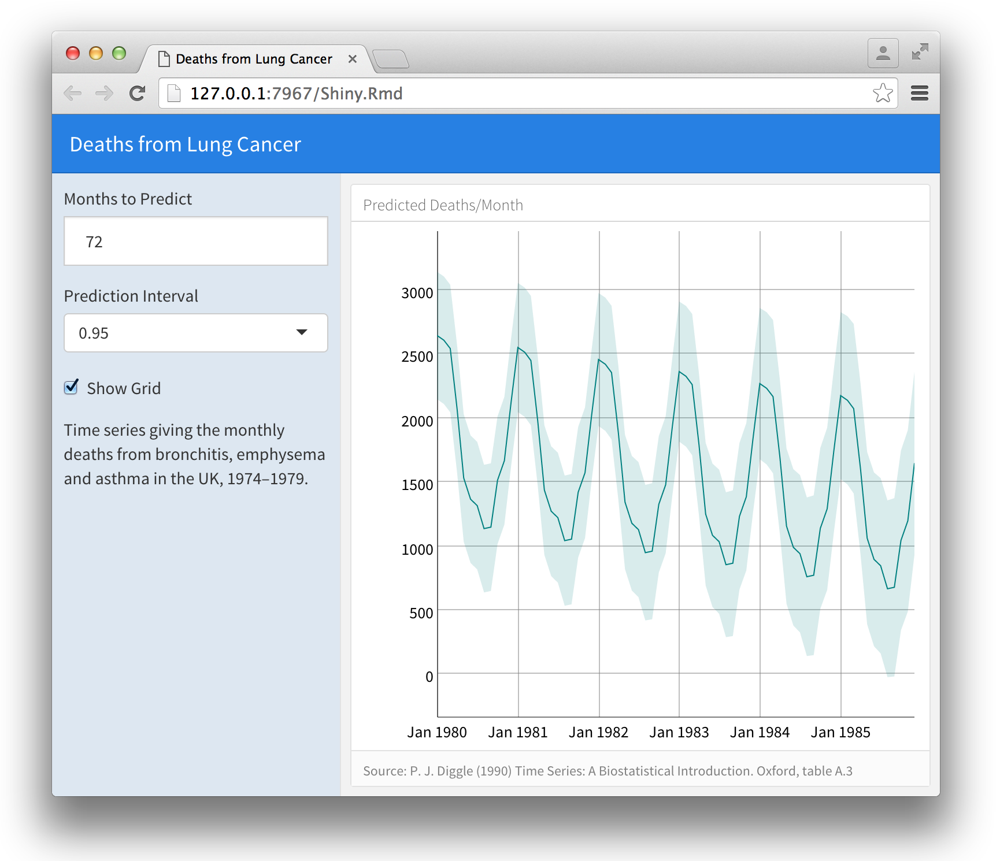

## Overview

By adding [Shiny](http://shiny.rstudio.com) to a flexdashboard, you can create dashboards that enable viewers to change underlying parameters and see the results immediately. This is done by adding `runtime: shiny` to a standard flexdashboard and then adding one or more input controls that dynamically drive the appearance of the charts within the dashboard.

Using Shiny with flexdashboard turns a static R Markdown report into an [Interative Document](http://rmarkdown.rstudio.com/authoring_shiny.html). It's important to note that interactive documents need to be [deployed](http://rmarkdown.rstudio.com/authoring_shiny.html#deployment) to a Shiny Server to be shared broadly (whereas static R Markdown documents are standalone web pages that can be attached to emails or served from any standard web server).

### Requirements

The steps required to add Shiny components to a flexdashboard are as follows:

1. Add `runtime: shiny` to the options declared at the top of the document (YAML front matter).

2. Add the `{.sidebar}` attribute to the first column of the dashboard to make it a host for Shiny input controls (note this step isn't strictly required but nearly all Shiny based dashboards will want to do this).

3. Add Shiny inputs and output as appropriate. 

A simple example of a Shiny based flexdashboard is provided below. 

## Example

The following example demonstrates the basics of using Shiny within a flexdashboard:

### Source Code

Here's the source code for the example. Note that since we have only a single chart as output we definitely want it to fill all of the available space. To accomplish this we add `fill_page: true` to the output options.

The first column ("Inputs") includes the `{.sidebar}` attribute and the Shiny input controls; the second column ("Outputs") includes the Shiny code required to render the chart based on the inputs.

## Sidebar 

The `{.sidebar}` attribute is a special designator indicating that a column should be laid out flush to the left with a fixed width of 250 pixels and a special background color. Sidebars are not required for flexdashboards using `runtime: shiny` however they are often useful for presenting inputs.

Sidebars always appear on the left no matter where they are defined within the flow of the document. You alter the default width of the sidebar using the `data-width` attribute. For example:

## flexdashboard vs. shinydashboard

The [shinydashboard](https://rstudio.github.io/shinydashboard/) package also provides facilities for creating interactive dashboards with Shiny. The two packages take different approaches and as a result have different strengths and weaknesses:

1. shinydashboard supports a wider variety of layout controls and output types at the expense of  additional syntactic complexity (use of R functions to define layout).

2. For dashboards that consist of presenting a few related data visualizations flexdashboard is  easier to learn and use (use of R Markdown sections and code chunks to define layout).

3. flexdashboard can create standalone web dashboards (requiring no Shiny Server) if they are restricted to just presenting data rather than allowing the user to vary assumptions and parameters.

## Learning More

To learn more about using Shiny with flexdashboard see the following resources:

1. The [Introduction to Interactive Documents](http://shiny.rstudio.com/articles/interactive-docs.html) article provides a great resources for getting started with Shiny and R Markdown.

1. The [Interactive Documents](http://rmarkdown.rstudio.com/authoring_shiny.html) article on the R Markdown web site provides additional introductory material as well as information on deploying interactive documents.

2. The [Shiny Dev Center](http://shiny.rstudio.com) includes extensive articles, tutorials, and examples to help you learn more about Shiny.
