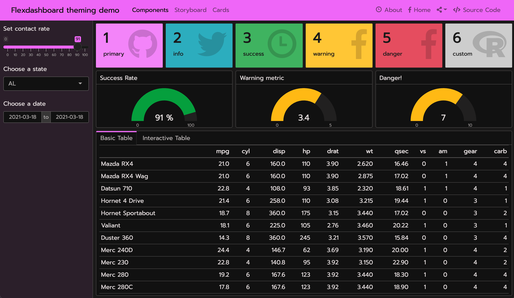

```{r setup, include=FALSE}
library(quillt)
```
  
## Using themes

The `flex_dashboard` output format includes a `theme` parameter for customizing the overall appearance of the dashboard. This parameter has special awareness of the [`{bslib}` package](https://rstudio.github.io/bslib/), which provides tools for using the [Bootstrap CSS framework](https://getbootstrap.com/) directly from R. 

Using the `theme` parameter, you have access to a library of pre-made custom themes built for Bootstrap called [Bootswatch](https://bootswatch.com/). The `theme` parameter can be set to any named Bootswatch theme (in lowercase) built for [Bootstrap version 3](https://bootswatch.com/3/) or [version 4](https://bootswatch.com/). 

For example, here's how you could give your dashboard a [(Bootswatch 4) Minty theme](https://bootswatch.com/minty/).

```yaml
---
output:
  flexdashboard::flex_dashboard:
    theme: 
      version: 4
      bootswatch: minty
---
```

<!--Carson- can you expand on when you need to specify Bootstrap version- should we recommend always? what is the default if not stated?-->

This screenshot shows the result of applying the above `theme` to [this example dashboard](https://gist.github.com/cpsievert/04bedbe9af652fab8c24a5e5eee0d721) that [uses Shiny](shiny.html) (subsequent screenshots also use this example, but swap out different `theme`s).

{.snippet}

## Custom themes

You can also create your own custom theme by setting the [main colors and fonts](https://rstudio.github.io/bslib/articles/theming.html#main-colors-fonts) (e.g., `bg`, `fg`, `primary`, `base_font`, `code_font`, etc.) as well as more specific theming options, [such as `navbar-bg`](https://rstudio.github.io/bslib/articles/bs4-variables.html#navbar-bg). Under the hood, this works by passing the `theme` to `bslib::bs_theme()` which influences the final look of the page by creating a custom build of Bootstrap (and Flexdashboard) CSS.

<!--Carson- do these variables only work for version 4? also, can you combine with a theme- maybe worth saying you can do theme plus variables, or just use variables on their own?-->

```r
---
output:
  flexdashboard::flex_dashboard:
    theme:
      version: 4
      bg: "#101010"
      fg: "#FDF7F7" 
      primary: "#ED79F9"
      navbar-bg: "#3ADAC6"
      base_font: !expr bslib::font_google("Prompt")
      code_font: !expr bslib::font_google("JetBrains Mono")
---
```

{.snippet}

<!--I'd love to see the fonts part separated with an L2 header so it is easier to skim and see, plus linkable-->

As shown above, a major benefit of theming via `{bslib}` is that theming of things like `gauge()`, `valueBox()`, and even `DT::datatable()` "just work" (that is, their styling defaults are informed by the `{bslib}` theme). 

These components work with `{bslib}`'s real-time theming widget, which you can add to `flex_dashboard` by adding either:

+ `runtime: shiny` to the document's yaml matter and calling `bslib::bs_themer()`, or

<!--where should the bs_themer call happen? does it matter?-->

+ `runtime: shinyrmd` to the document's yaml matter and calling `bslib::bs_themer()` in a code chunk with `context='server'`.

<!--example code chunk? I don't know what to do here-->

{.snippet}

## Theme output

Generally, most "un-opinionated" HTML content rendered by the web browser "just works" with `{bslib}`. This means that the styles you specify for your document will cascade correctly. However, some HTML elements that aren't rendered by the browser aren't necessarily aware of `{bslib}` (or CSS in general). 

To theme static R plots (e.g., `{ggplot2}`), you can call `thematic::thematic_rmd()` in a setup chunk to translate the `{bslib}` theme main colors to R plot theming defaults. 

Additionally, if you're using Google Fonts, or some other font that you've registered with R, you can safely include `font = "auto"` to translate fonts as well:

````
`r ''````{r setup, include = FALSE}
thematic::thematic_rmd(font = "auto")
```
````

{.snippet}

## Using CSS or SASS

If you want to go beyond `{bslib}`'s theming features, you can add your own custom CSS. For this, you can provide relevant file(s) to `flex_dashboard`'s `css` argument, and if you're using `{bslib}`, you can provide `.scss` file(s) with additional [Sass](https://sass-lang.com/) rules. When compiled, those Sass rules have access to Bootstrap Sass variables, functions, and mixins. This allows you to [write custom CSS styles in a "themeable" way](https://rstudio.github.io/bslib/articles/theming.html#a-basic-themeable-component) and/or simply leverage useful Sass functions like [`color-contrast()`](https://github.com/rstudio/bslib/blob/df10a878e0e9d1e42c83b4c2101bc8d9f00ad314/inst/sass-utils/color-contrast.scss#L9).

```yaml
---
output:
  flexdashboard::flex_dashboard:
    css: my-custom-rules.scss
    theme: 
      version: 4
---
```

<!--Carson- can we provide even just one example rule here using a bootstrap variable?-->
