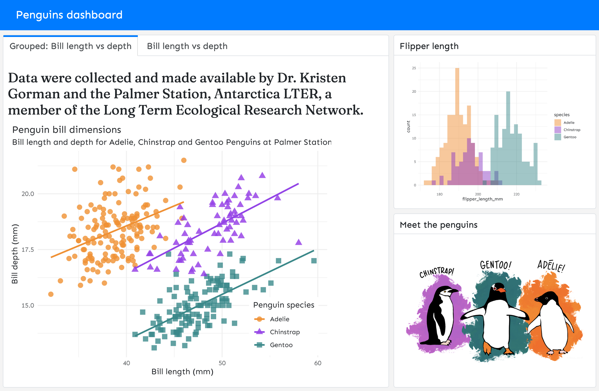
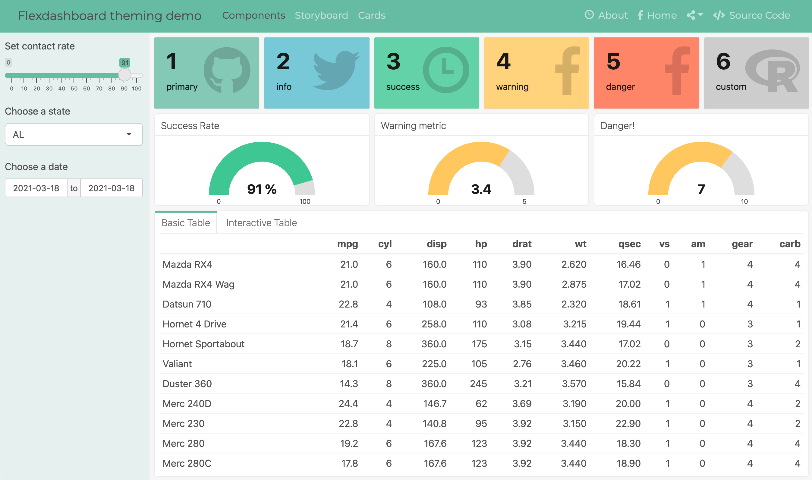
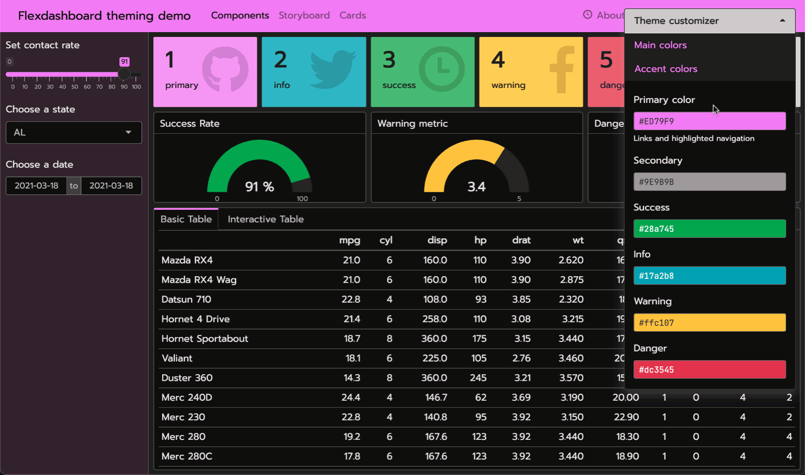
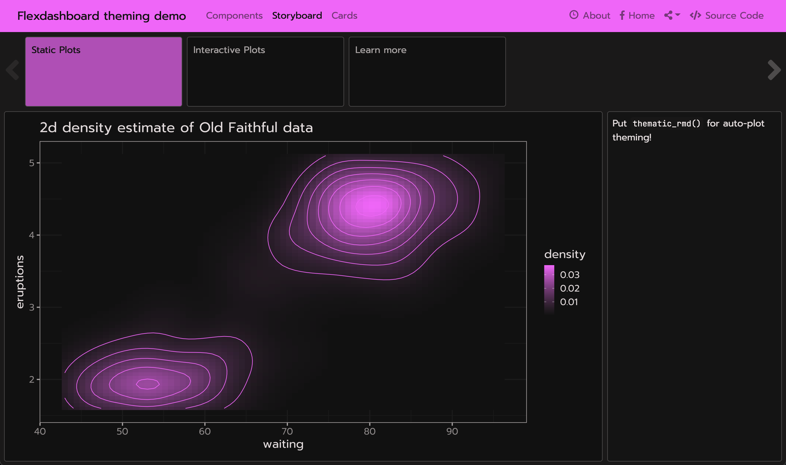
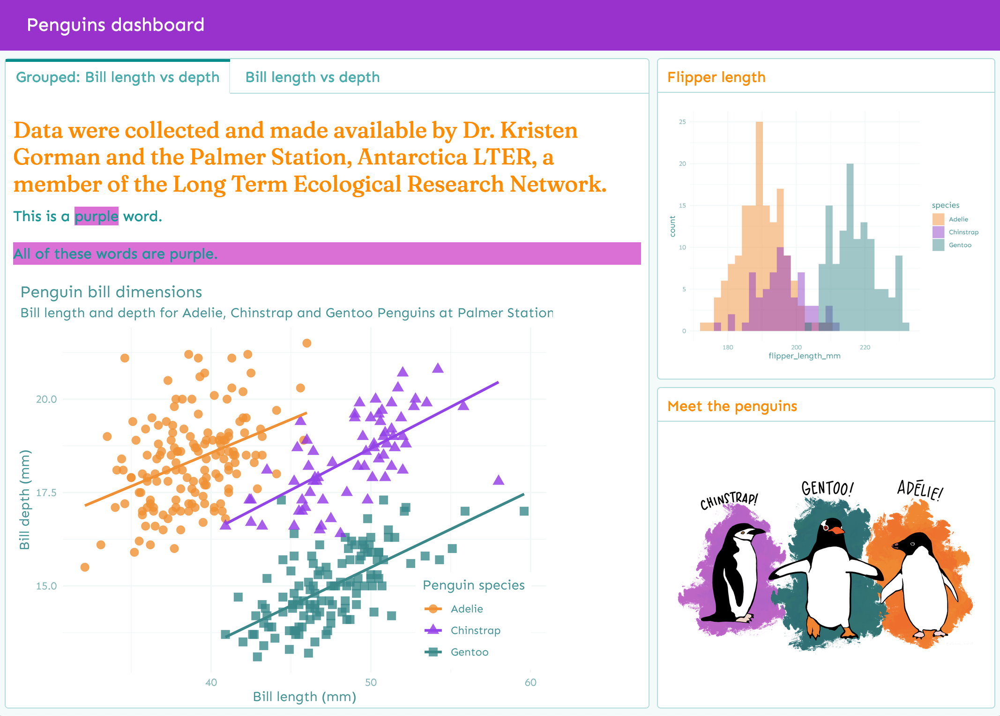
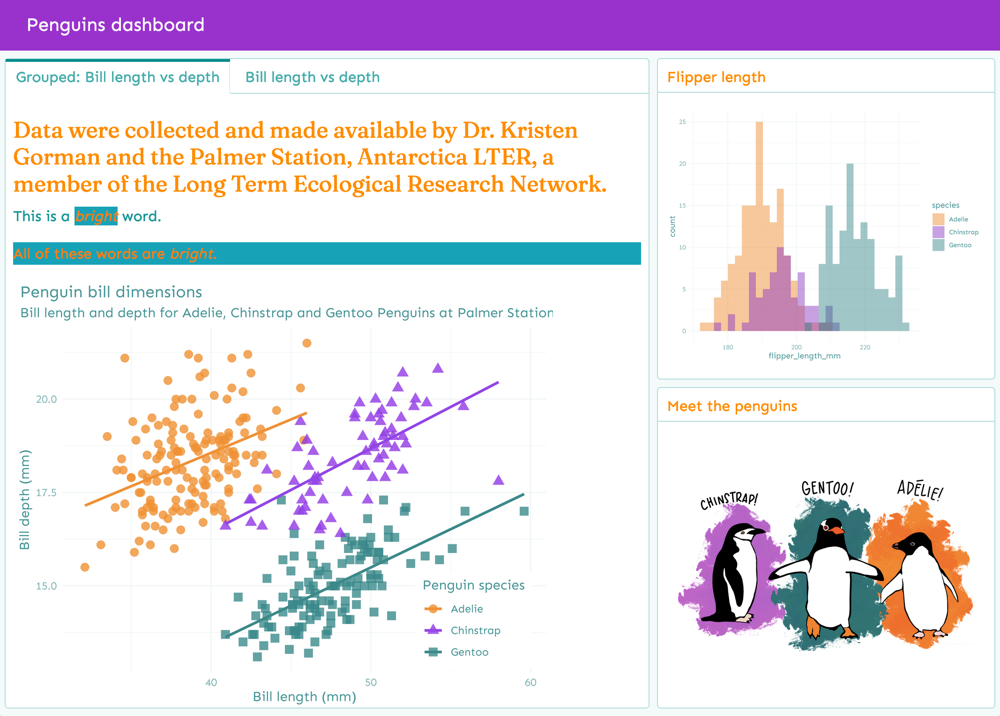
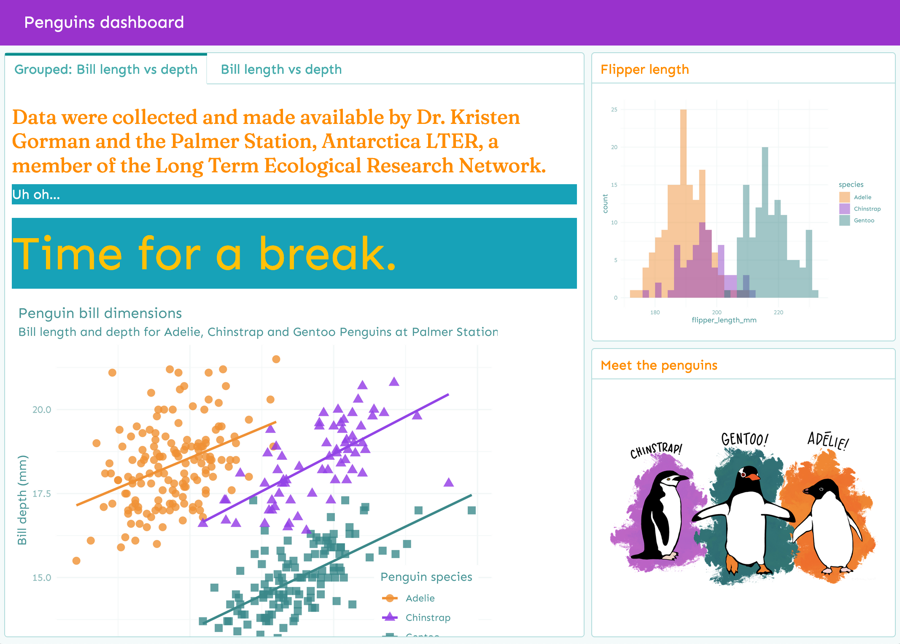
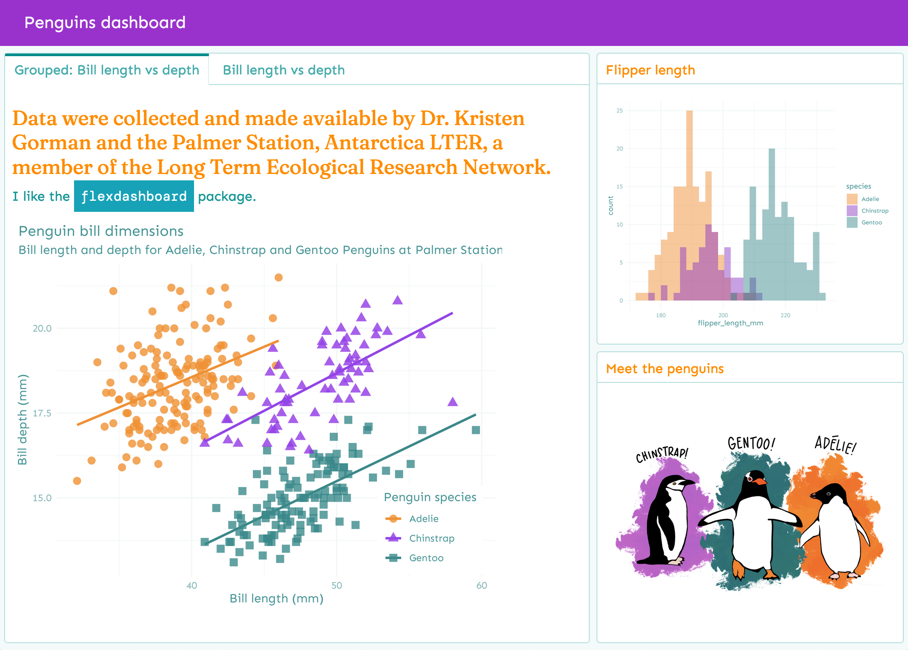

```{r setup, include=FALSE}
library(quillt)
```

## Using Bootstrap

The `flex_dashboard` output format gives you access to the [Bootstrap CSS framework](https://getbootstrap.com/). Bootstrap is a library of reusable chunks of HTML, CSS, and JavaScript code that you can call on to modify your flexdashboard without writing that code yourself. Originally [created by and for Twitter](https://en.wikipedia.org/wiki/Bootstrap_(front-end_framework)), it is a free and open source project; you can view the repository on [GitHub](https://github.com/twbs/bootstrap). 

The `flex_dashboard` output format includes a `theme` parameter for customizing the overall appearance of the dashboard. This parameter has special awareness of the [`{bslib}` package](https://rstudio.github.io/bslib/), which provides tools for using the [Bootstrap CSS framework](https://getbootstrap.com/) directly from R. For now, you'll need to install the development version of the package to use it:

``` {.r}
# install.packages("remotes")
remotes::install_github("rstudio/bslib")
```

The minimum YAML for invoking the `{bslib}` package is:

``` {.yaml}
---
output:
  flexdashboard::flex_dashboard:
    theme: 
      version: 4
---
```

Bootstrap has several versions (at the time of writing, version 4 is the most recent). If you are starting on a fresh project, we recommend using the latest version. We also recommend you set the Bootstrap version in your YAML for better reproducibility. 

### Using fonts {#using-fonts}

You can quickly change the `heading_font`, `base_font`, and `code_font` from your document's YAML. For example, here we use three [Google fonts](https://fonts.google.com/):

``` {.yaml}
output:
  flexdashboard::flex_dashboard:
    theme:
      version: 4
      heading_font:
        google: Fraunces
      base_font: 
        google: Sen
      code_font: 
        google: DM Mono
```


This screenshot shows the result of applying these fonts to a simple `flex_dashboard`:

{.snippet}

By default, [`{bslib}`](https://rstudio.github.io/bslib/) (via the [`{sass}` package](https://rstudio.github.io/sass/)) downloads, caches, and serves the relevant font file(s) locally. By locally serving files, there's a guarantee that the font can render in any client browser, even when the client doesn't have internet access.

If you want to use only specific font weights, you can further nest your font selections; for example:

``` {.yaml}
output:
  flexdashboard::flex_dashboard:
    theme:
      version: 4
      heading_font:
        google: 
          family: Fraunces
          wght: "100..300"
```


### Using Bootswatch themes

Using the `theme` parameter, you have access to a library of pre-made custom themes built for Bootstrap called [Bootswatch](https://bootswatch.com/). The `theme` parameter can be set to any named Bootswatch theme (in lowercase) built for [Bootstrap version 3](https://bootswatch.com/3/) or [version 4](https://bootswatch.com/).

For example, here's how you could give your dashboard a [(Bootswatch 4) Minty theme](https://bootswatch.com/minty/).

``` {.yaml}
---
output:
  flexdashboard::flex_dashboard:
    theme: 
      version: 4
      bootswatch: minty
---
```


This screenshot shows the result of applying the above `theme` to [this example dashboard](https://gist.github.com/cpsievert/04bedbe9af652fab8c24a5e5eee0d721) that [uses Shiny](shiny.html) (subsequent screenshots also use this example, but swap out different `theme`s).

{.snippet}

### Custom Bootstrap themes

You can also create your own custom theme by setting the [main colors and fonts](https://rstudio.github.io/bslib/articles/theming.html#main-colors-fonts) (e.g., `bg`, `fg`, `primary`, `base_font`, `code_font`, etc.) as well as more specific theming options, [such as `navbar-bg`](https://rstudio.github.io/bslib/articles/bs4-variables.html#navbar-bg). Under the hood, this works by passing the `theme` to `bslib::bs_theme()` which influences the final look of the page by creating a custom build of Bootstrap (and Flexdashboard) CSS.

``` {.r}
---
output:
  flexdashboard::flex_dashboard:
    theme:
      version: 4
      bg: "#101010"
      fg: "#FDF7F7" 
      primary: "#ED79F9"
      navbar-bg: "#3ADAC6"
      base_font: 
        google: Prompt
      code_font:
        google: JetBrains Mono
---
```

{.snippet}

As shown above, a major benefit of theming via `{bslib}` is that theming of things like `gauge()`, `valueBox()`, and even `DT::datatable()` "just work" (that is, their styling defaults are informed by the `{bslib}` theme).

These components work with `{bslib}`'s real-time theming widget, which you can add to `flex_dashboard` by adding either:

-   `runtime: shiny` to the document's yaml matter and calling `bslib::bs_themer()` in any code chunk, or

-   `runtime: shinyrmd` to the document's yaml matter and calling `bslib::bs_themer()` in a code chunk with `context='server'`:

        ```{r setup, include = FALSE, context = "server"}`r ''`
        bslib::bs_themer()
        ```

{.snippet}

### Theme output

Generally, most "un-opinionated" HTML content rendered by the web browser "just works" with `{bslib}`. This means that the styles you specify for your document will cascade correctly. However, some HTML elements that aren't rendered by the browser aren't necessarily aware of `{bslib}` (or CSS in general).

To theme static R plots (e.g., `{ggplot2}`), you can call `thematic::thematic_rmd()` in a setup chunk to translate the `{bslib}` theme main colors to R plot theming defaults.

Additionally, if you're using Google Fonts, or some other font that you've registered with R, you can safely include `font = "auto"` to translate fonts as well:

    ```{r setup, include = FALSE}`r ''`
    thematic::thematic_rmd(font = "auto")
    ```

{.snippet}

If you use one of the `{ggplot2}` [complete themes](https://ggplot2.tidyverse.org/reference/ggtheme.html) (like `theme_bw()` or `theme_minimal()`, for example), we recommend setting the theme globally for the `flex_dashboard` in a `setup` chunk, then turning thematic on *after*.

    ```{r setup, include = FALSE}`r ''`
    library(ggplot2)
    theme_set(theme_minimal())
    thematic::thematic_rmd(font = "auto")
    ```
    
Read more about the `{thematic}` package here: 
`vignette("custom", package = "thematic")`.

## Using CSS

Whether or not you use [Bootstrap](#using-bootstrap), you may add your own CSS file to customize how your `flex_dashboard` looks. This file can contain plain CSS rules, like:

``` {.css}
.my-purple {
  background-color: #da70d6;
}
```

For this, you can provide relevant file(s) to `flex_dashboard`'s `css` argument:

``` {.yaml}
---
output:
  flexdashboard::flex_dashboard:
    css: my-custom-rules.css
---
```

Then use your CSS rules in the body of your dashboard, for example:

``` {.html}
This is a <span class="my-purple">purple</span> word.
```

You may achieve the same result writing with Pandoc's spans:

``` {.html}
This is a [purple]{.my-purple} word.
```

You can also add CSS divs using Pandoc's [fenced Div blocks](https://pandoc.org/MANUAL.html#divs-and-spans):

``` {.html}
::: {.my-purple}
All of these words are purple.
:::
```

When knit, these blocks are translated into HTML like so:

``` {.html}
<div class="my-purple">
<p>All of these words are purple.</p>
</div>
```

Here is the knitted output that includes these custom rules:

{.snippet}

You can read more about Pandoc's custom blocks in the [R Markdown Cookbook](https://bookdown.org/yihui/rmarkdown-cookbook/custom-blocks.html).

## Using SASS

If you want to go beyond `{bslib}`'s theming features, you can provide `.scss` file(s) with additional [Sass](https://sass-lang.com/) rules. Sass is only supported if using `{bslib}` (inferred from using the `theme` in the YAML):

``` {.yaml}
---
output:
  flexdashboard::flex_dashboard:
    css: my-sass-rules.scss
    theme: 
      version: 4
---
```

This file can contain [plain CSS rules](#using-css), as well as rules that use Bootstrap Sass variables. These variables are denoted by `$` followed by a variable name, like `$cyan`:

``` {.scss}
.bs4-bright {
  background-color: $cyan;
  color: $orange;
}
```

Then in your text you may use raw HTML or Pandoc syntax (as shown above):

``` {.html}
This is a [*bright*]{.bs4-bright} word.
```

``` {.html}
::: {.bs4-bright}
All of these words are *bright*.
:::
```

Here is the knitted output that includes these custom rules:

{.snippet}

You can find a full list of variables in `vignette("bs4-variables", package = "bslib")`.

When compiled, those Sass rules have access to Bootstrap Sass variables, functions, and mixins. This allows you to [write custom CSS styles in a "themeable" way](https://rstudio.github.io/bslib/articles/theming.html#a-basic-themeable-component) and/or simply leverage useful Sass functions like [`color-contrast()`](https://github.com/rstudio/bslib/blob/df10a878e0e9d1e42c83b4c2101bc8d9f00ad314/inst/sass-utils/color-contrast.scss#L9).

For example, we can use the Sass [`@extend`](https://sass-lang.com/documentation/at-rules/extend) rule in our `.scss` file to bundle together multiple Bootstrap variables and tell Sass that one selector should inherit the styles of another:

``` {.scss}
.error {
  background-color: $cyan;
  color: $white;

  &--serious {
    @extend .error;
    color: $warning;
    font-size: $display4-size;
  }
}
```

Then you can use those rules in the body of your dashboard:

``` {.html}
::: {.error}
Uh oh...
:::

::: {.error--serious}
Time for a break.
:::
```

Here is the knitted output that includes these custom rules:

{.snippet}

You may also reuse any [fonts](#using-fonts) specified in your YAML with SASS variables.

| YAML key       | Bootstrap 4 variable     |
|----------------|--------------------------|
| `heading_font` | `$headings-font-family`  |
| `base_font`    | `$font-family-base`      |
| `code_font`    | `$font-family-monospace` |

So we could set up the following rule:
``` {.scss}
.pkg-name {
  background-color: $cyan;
  color: $white;
  font-family: $font-family-monospace;
  padding: .5rem;
}
```

Then use it in the body:

```{.html}
I like the [flexdashboard]{.pkg-name} package.
```

Here is the knitted output:

{.snippet}

## Resources

This vignette just scratches the surface of how to use Bootstrap variables and SASS together. Both are powerful tools for customizing the look and feel of your HTML documents. To learn more, see:

-   Bootstrap docs: <https://getbootstrap.com/docs/4.0/>
-   Sass docs: <https://sass-lang.com/documentation>
-   The bslib package docs (for Bootstrap): https://rstudio.github.io/bslib/
-   The sass package docs (for fonts): https://rstudio.github.io/sass/
-   The thematic package docs (for theming plot output): https://rstudio.github.io/thematic/
