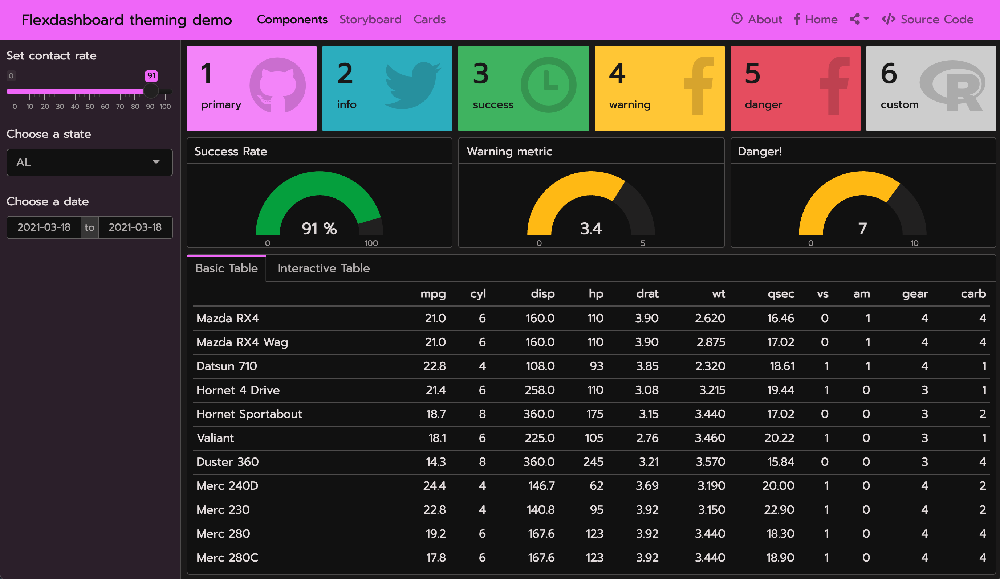

```{r setup, include=FALSE}
library(quillt)
```

## Bootstrap and bslib

The `flex_dashboard` output format builds upon the [Bootstrap CSS framework](https://getbootstrap.com/). Bootstrap is a library of reusable chunks of HTML, CSS, and JavaScript code that you can call on to modify your flexdashboard without writing that code yourself. Originally [created by and for Twitter](https://en.wikipedia.org/wiki/Bootstrap_(front-end_framework)), it is a free and open source project; you can view the repository on [GitHub](https://github.com/twbs/bootstrap). 

The `flex_dashboard` output format includes a `theme` parameter for customizing the overall appearance of the dashboard. This parameter has special integration with the [`{bslib}` package](https://rstudio.github.io/bslib/), which makes it easy to customize [Bootstrap CSS](https://getbootstrap.com/) styles directly from R.

`{bslib}` [supports multiple versions](https://rstudio.github.io/bslib/articles/bslib.html#bootstrap-versions) of Bootstrap so that both new and legacy projects can leverage [custom themes](https://rstudio.github.io/bslib/articles/bslib.html#custom-themes). If you are starting on a fresh project, we recommend choosing the latest supported version (currently, `version: 4`), but legacy projects may want to set `version: 3`:

``` {.yaml}
---
output:
  flexdashboard::flex_dashboard:
    theme: 
      version: 4
---
```

### Bootswatch themes

`{bslib}` provides access to any [Bootswatch 4](https://bootswatch.com/) (new projects) or [3](https://bootswatch.com/3) (legacy projects). For example, here's how you could give your dashboard a [(Bootswatch 4) Minty theme](https://bootswatch.com/minty/).

``` {.yaml}
---
output:
  flexdashboard::flex_dashboard:
    theme: 
      version: 4
      bootswatch: minty
---
```

This screenshot shows the result of applying the above `theme` to [this example dashboard](https://gist.github.com/cpsievert/04bedbe9af652fab8c24a5e5eee0d721) that [uses Shiny](shiny.html) (subsequent screenshots also use this example, but swap out different `theme`s).

{.snippet}

### Custom themes {#custom-themes}

You can also create your own [custom `{bslib}` theme](https://rstudio.github.io/bslib/articles/bslib.html#custom-themes) by setting the [main colors and fonts](https://rstudio.github.io/bslib/articles/bslib.html#main-colors-fonts) as well as [more specific theming](https://rstudio.github.io/bslib/articles/bslib.html#everything-else) options, [such as `navbar-bg`](https://rstudio.github.io/bslib/articles/bs4-variables.html#navbar-bg). For custom font settings, adding a `google:` keyword triggers `sass::font_google()`'s ability to automatically import Google Font files. By default, `google:` will bundle font files with your dashboard, so that when you share it with someone else, the fonts are guaranteed to render, even without an internet connection (`local: false` imports files via URL instead of serving them locally).

``` {.r}
---
output:
  flexdashboard::flex_dashboard:
    theme:
      version: 4
      bg: "#101010"
      fg: "#FDF7F7" 
      primary: "#ED79F9"
      navbar-bg: "#3ADAC6"
      base_font: 
        google: Prompt
      heading_font:
        google: Sen
      code_font:
        google: 
          # arguments to sass::font_google() 
          family: JetBrains Mono
          local: false
---
```

{.snippet}

[See here](https://rstudio.github.io/bslib/articles/bslib.html#custom-themes) to learn more about `{bslib}`'s custom themes.

## Real-time theming {#real-time-themes}

[`{bslib}`'s real-time theming widget](https://rstudio.github.io/bslib/articles/bslib.html#real-time-theming) allows you to interactively customize `theme:` by adding:

-   `runtime: shiny` to the document's yaml matter and calling `bslib::bs_themer()` in any code chunk, or

-   `runtime: shinyrmd` to the document's yaml matter and calling `bslib::bs_themer()` in a code chunk with `context='server'`:

        ```{r setup, include = FALSE, context = "server"}`r ''`
        bslib::bs_themer()
        ```

{.snippet}


### Auto-theming R plots

Generally, most "un-opinionated" HTML content rendered by the web browser should "just work" with your `theme` settings. However, some outputs that aren't rendered by the browser (e.g., R plots) aren't necessarily aware of `{bslib}` (or CSS in general).

To theme static R plots (e.g., `{ggplot2}`), you can call `thematic::thematic_rmd()` in a setup chunk to translate the `{bslib}` theme main colors to R plot theming defaults.

Additionally, if you're using Google Fonts, or some other font that you've registered with R, you can safely include `font = "auto"` to translate fonts as well:

    ```{r setup, include = FALSE}`r ''`
    thematic::thematic_rmd(font = "auto")
    ```

{.snippet}

To learn more about `{thematic}`, see <https://rstudio.github.io/thematic>

## Add CSS styles

Although [custom theming](#custom-themes) is great for customizing Bootstrap and Flexdashboard CSS, you still may want to add more styling rules to customize the appearance of your dashboard. This file can contain plain CSS rules, like:

``` {.css}
.my-purple {
  background-color: #da70d6;
}
```

For this, you can provide relevant file(s) to `flex_dashboard`'s `css` argument:

``` {.yaml}
---
output:
  flexdashboard::flex_dashboard:
    css: my-custom-rules.css
---
```

Then use your CSS rules in the body of your dashboard, for example:

``` {.html}
This is a <span class="my-purple">purple</span> word.
```

You may achieve the same result writing with Pandoc's spans:

``` {.html}
This is a [purple]{.my-purple} word.
```

You can also add CSS divs using Pandoc's [fenced Div blocks](https://pandoc.org/MANUAL.html#divs-and-spans):

``` {.html}
::: {.my-purple}
All of these words are purple.
:::
```

When knit, these blocks are translated into HTML like so:

``` {.html}
<div class="my-purple">
<p>All of these words are purple.</p>
</div>
```

Here is the knitted output that includes these custom rules:

{.snippet}

You can read more about Pandoc's custom blocks in the [R Markdown Cookbook](https://bookdown.org/yihui/rmarkdown-cookbook/custom-blocks.html).

## Add Sass rules

[Sass](https://sass-lang.com/) is a language designed for writing better CSS. Thankfully, the `css` parameters also understands `.scss` (i.e., Sass) file(s):

``` {.yaml}
---
output:
  flexdashboard::flex_dashboard:
    css: my-sass-rules.scss
    theme: 
      version: 4
---
```

Sass files can contain [plain CSS rules](#using-css), as well as rules that use [Bootstrap Sass variables](https://rstudio.github.io/bslib/articles/bs4-variables.html). These variables are denoted by `$` followed by a variable name, like `$cyan`:

``` {.scss}
.bs4-bright {
  background-color: $cyan;
  color: $orange;
}
```

Then in your text you may use raw HTML or Pandoc syntax (as shown above):

``` {.html}
This is a [*bright*]{.bs4-bright} word.
```

``` {.html}
::: {.bs4-bright}
All of these words are *bright*.
:::
```

Here is the knitted output that includes these custom rules:

{.snippet}

You can find a full list of variables in `vignette("bs4-variables", package = "bslib")`.

When compiled, those Sass rules have access to Bootstrap Sass variables, functions, and mixins. This allows you to [write custom CSS styles in a "themeable" way](https://rstudio.github.io/bslib/articles/custom-components.html) and/or simply leverage useful Sass functions like [`color-contrast()`](https://github.com/rstudio/bslib/blob/df10a87/inst/sass-utils/color-contrast.scss#L9).

For example, we can use the Sass [`@extend`](https://sass-lang.com/documentation/at-rules/extend) rule in our `.scss` file to bundle together multiple Bootstrap variables and tell Sass that one selector should inherit the styles of another:

``` {.scss}
.error {
  background-color: $cyan;
  color: $white;

  &--serious {
    @extend .error;
    color: $warning;
    font-size: $display4-size;
  }
}
```

Then you can use those rules in the body of your dashboard:

``` {.html}
::: {.error}
Uh oh...
:::

::: {.error--serious}
Time for a break.
:::
```

Here is the knitted output that includes these custom rules:

{.snippet}

You may also reuse any [fonts](#custom-themes) specified in your YAML with Sass variables.

| YAML key       | Bootstrap 4 variable     |
|----------------|--------------------------|
| `heading_font` | `$headings-font-family`  |
| `base_font`    | `$font-family-base`      |
| `code_font`    | `$font-family-monospace` |

So we could set up the following rule:

``` {.scss}
.pkg-name {
  background-color: $cyan;
  color: $white;
  font-family: $font-family-monospace;
  padding: .5rem;
}
```

Then use it in the body:

```{.html}
I like the [flexdashboard]{.pkg-name} package.
```

Here is the knitted output:

{.snippet}

## Resources

This vignette provides a brief overview of `{bslib}`'s integration with `{flexdashboard}`, but there's a lot more to theming with `{bslib}` (i.e. Bootstrap Sass), `{sass}` (i.e., Sass), and `{thematic}`. To learn more, see:

-   The `{bslib}` package docs: <https://rstudio.github.io/bslib/>
-   The `{sass}` package docs (for writing Sass code in R): <https://rstudio.github.io/sass/>
-   The `{thematic}` package docs (for theming plot output): <https://rstudio.github.io/thematic/>
-   Sass language docs: <https://sass-lang.com/documentation>
-   Bootstrap docs: <https://getbootstrap.com/docs/4.0/>
